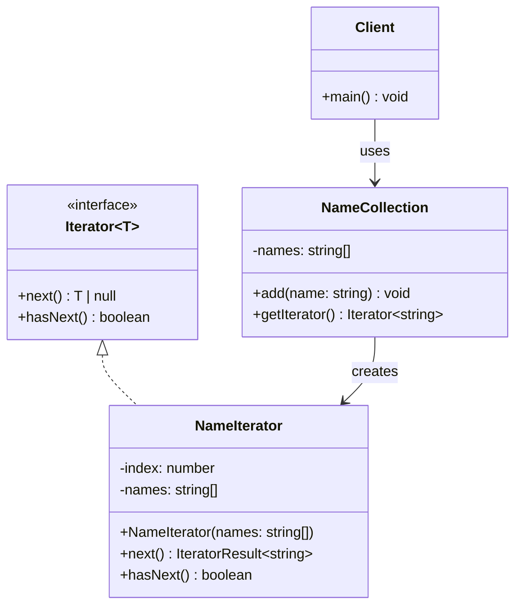

# Iterator Pattern

Sequential access to elements without knowing it's abstract implementation

```mermaid
classDiagram

%% Interfaces
class Iterator~T~ {
  <<interface>>
  +next() T | null
  +hasNext() boolean
}

%% Concrete Iterator
class NameIterator {
  -index: number
  -names: string[]
  +NameIterator(names: string[])
  +next() IteratorResult~string~
  +hasNext() boolean
}

%% Collection
class NameCollection {
  -names: string[]
  +add(name: string) void
  +getIterator() Iterator~string~
}

%% Client
class Client {
  +main() void
}

%% Relationships
Iterator <|.. NameIterator
NameCollection --> NameIterator : creates
Client --> NameCollection : uses
```
